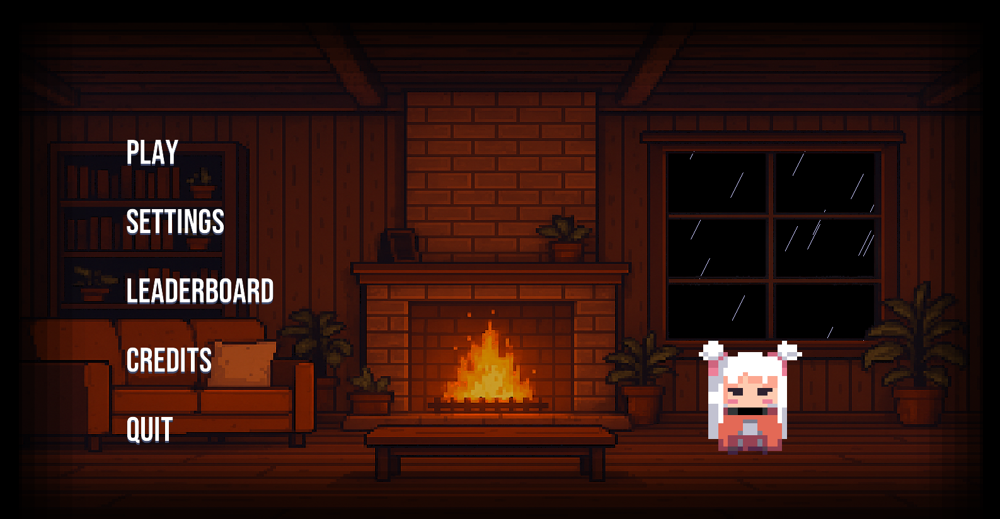

# 🎮 Insert Your Game Name Here

  

## 📖 Introduction
<i>Insert Game Name Here</i> is a small game project that we decided to make for fun.  
The title is actually the name for the game, we decided to name our game <i>Insert Game Name Here</i> as a joke.  

This game is a 2.5D Game, your goal is to fight the enemies, get coins, buy weapons, and defeat the boss.
 

Trailer: [YouTube](https://youtu.be/EKWCecYS4os?si=Q21lvSB9oAQnTZ1g)  
 

## 📝 Note / Disclaimer
This project is a **public, non-commercial** game made for fun and learning purposes.  
It is not affiliated with or endorsed by any company or franchise referenced in the project.  
 
If any third-party assets (art, audio, fonts, etc.) are used, they remain the property of their respective owners and are used for educational/demo purposes only.  
If you are a rights holder and would like something removed or credited differently, please open an issue or contact us.  
 

## 🛠️ How to Install
1. Install the IDE CLion
2. Install the library Allegro5 (Make sure it's installed on C: Drive)
3. Install the compiler LLVM MinGW
4. Install CMake
5. Set environment path for Allegro5, and LLVM MinGW
 

## 🎯 Project Goals
1. Make a full working game
2. Try out C++
3. Try out CMake
4. Make the game with fun
 

## 🪛 Tools
- Programming Language C++
- CLion <[Link](https://www.jetbrains.com/toolbox-app/)>
- Allegro5 <[Link](https://github.com/liballeg/allegro5/releases/download/5.2.9.1/allegro-x86_64-w64-mingw32-gcc-13.2.0-posix-seh-static-5.2.9.0.zip)>
- CMake x86 <[Link](https://github.com/Kitware/CMake/releases/download/v3.29.2/cmake-3.29.2-windows-x86_64.msi)>
- CMake Arm64 <[Link](https://github.com/Kitware/CMake/releases/download/v3.29.2/cmake-3.29.2-windows-arm64.msi)>
- LLVM MinGW <[Link](https://github.com/mstorsjo/llvm-mingw/releases/download/20240417/llvm-mingw-20240417-msvcrt-x86_64.zip)>
 

## 💡 Inspirations
- Guardian Tales <[Link](https://www.guardiantales.com/)>
- Jujutsu Kaisen <[Link](https://en.wikipedia.org/wiki/Jujutsu_Kaisen)>
 

## 👥 Project Members
- Albert Jonathan [(GitHub)](https://github.com/Cookie-1412)
- Patrick Kosasih [(GitHub)](https://github.com/patrickkosasih)
- Vincent Jefferson [(GitHub)](https://github.com/Fincarson)
 